Voici le schéma complet du pipeline RAG de ton service ILM AI. Le flux se décompose en 8 étapes clés :

1. **Input** — la question utilisateur arrive en français
2. **Filtre hors-sujet** — si aucun topic/intent islamique n'est détecté, on coupe court avec une réponse fixe
3. **Traduction + hybridation** — LLM FR→EN enrichi par la `KEYWORD_TRANSLATION_MAP` et la chirurgie lexicale (ex: Assia ≠ Aisha)
4. **Retrieval vectoriel** — recherche sémantique top-8 sur les 4 corpus (Quran, Hadith, Tafsir, Fatwa)
5. **Filtrage & élagage** — seuil à 0.30 + `_prune_irrelevant_chunks` pour éliminer les chunks sans rapport lexical
6. **Sélection thématique** — top 3 filtré par topic, avec fallback Fatwa si les scores scripturaires sont trop faibles, puis auto-couplage verset ↔ Tafsir
7. **Branchement** — réponse directe par règle métier (obligation/prohibition/pillars) OU génération LLM (identification/définition/cas complexes)
8. **Localisation + Output** — traduction EN→FR des sources non-coraniques, puis `ChatResponse` avec answer et sources enrichies!